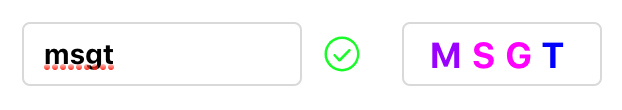

# react-validation-code





## 描述

```bash
这是一个基于react的验证码组件，通过输入验证码进行二次校验确认，
支持点击切换验证码、自定义样式、自定义点击按钮文案等。
```

## 技术栈

```bash
react
webpack4
```

## Install

```js
npm install react-validation-code
```

## Usage

```js
import VCode from "react-validation-code";

function getResult(r) {
  console.log(r);
}
const App = () => (
  <VCode
    getResult={getResult}
    tips
    tipsWord="换一张"
    className="xxx"
    placeholder="xxx"
    doneCom={ReactNode}
    errorCom={ReactNode}
  />
);
```

## props

| 参数        | 说明                       | 类型                             | 默认值 | 是否必须 |
| ----------- | -------------------------- | -------------------------------- | ------ | ---------- |
| getResult   | 输入验证码后的回调         | <font color=red >function</font> | 无     | 是 |
| className   | 自定义类名                 | <font color=red >string</font>   | "v-code"     | 否 |
| placeholder | input 的 placeholder       | <font color=red >string</font>   | "请输入验证码"     | 否 |
| tips        | 是否显示点击切换验证码按钮 | <font color=red >boolean</font>  | false  | 否 |
| tipsWord    | 切换验证码按钮文字         | <font color=red >string</font>   | "看不清，换一张"     | 否 |
| doneCom     | 可以写个ReactNode替换自带的验证成功图片  | <font color=red >string or ReactNode</font>   | 组件自带的验证成功的图片     | 否 |
| errorCom    | 可以写个ReactNode替换自带的验证失败图片  | <font color=red >string or ReactNode</font>   | 组件自带的验证失败的图片     | 否 |